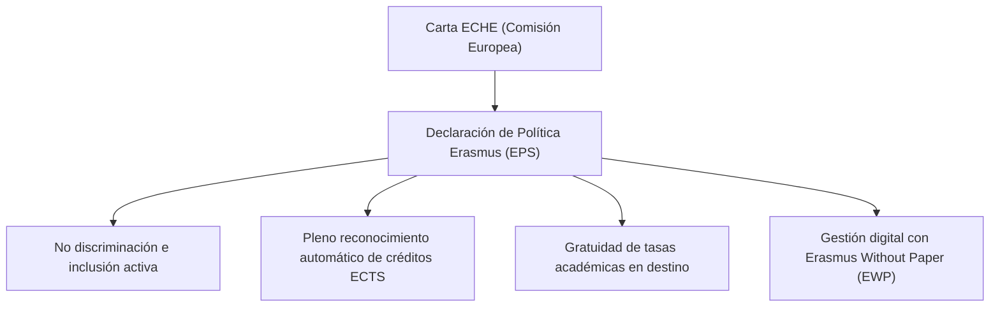

# Carta ECHE y Reconocimiento Académico (ECTS)

La participación de nuestro centro en la **Educación Superior Europea** está regulada por la **Carta Erasmus de Educación Superior (ECHE)** y por el sistema de transferencia y acumulación de créditos **ECTS** (*European Credit Transfer and Accumulation System*).

---

## 1. La Carta Erasmus de Educación Superior (ECHE)

La Carta ECHE es concedida por la Comisión Europea tras un riguroso proceso de evaluación. Constituye el marco general de calidad que define los principios éticos y operativos de todas las actividades de cooperación europea de Educación Superior:

### Compromisos Clave de la ECHE
- **Antes de la Movilidad:** Publicar catálogos informativos transparentes, baremos claros y formalizar los acuerdos de aprendizaje digitales (*Learning Agreement*) antes de cualquier desplazamiento.
- **Durante la Movilidad:** Garantizar la igualdad de trato académico e integración del estudiante internacional y prestar apoyo tutorial constante.
- **Después de la Movilidad:** Reconocer de forma plena e inmediata todas las actividades y créditos superados según el acuerdo suscrito, sin exigir exámenes adicionales al estudiante a su regreso.

---

## 2. Sistema de Reconocimiento de Créditos ECTS

En los **Ciclos Formativos de Grado Superior** de la Formación Profesional española (Nivel 5 MECES / EQF):
- Cada curso académico equivale a **60 créditos ECTS** (120 ECTS para el total del título de Técnico Superior).
- El módulo profesional de **Formación en Centros de Trabajo (FCT)** / Formación en Empresa tiene habitualmente una asignación curricular de **22 créditos ECTS** en los decretos de la Generalitat Valenciana.

### Procedimiento de Reconocimiento Académico

1. **Acuerdo de Formación Previo (*Learning Agreement for Traineeships*):**  
   Antes de viajar, se acuerda el programa de actividades laborales y formativas en la empresa europea, fijando su equivalencia directa con los resultados de aprendizaje del módulo de FCT (22 ECTS).
2. **Evaluación de la Entidad de Acogida:**  
   Al concluir el periodo, el tutor laboral en la empresa de destino emite el informe de evaluación y el *Traineeship Certificate*.
3. **Calificación en Acta Oficial:**  
   El equipo docente del ciclo formaliza la calificación de **"Apto"** en las actas oficiales de evaluación en la plataforma administrativa **ITACA** de la GVA.
4. **Emisión del Suplemento Europeo al Título (SET):**  
   Al tramitar el título de Técnico Superior, se incorpora en el Suplemento al Título la constancia expresa de la realización de la movilidad internacional Erasmus+, el país de acogida, la duración y los créditos ECTS convalidados.
5. **Documento Europass Movilidad:**  
   La coordinación del centro tramita y entrega al estudiante el documento oficial **Europass Movilidad**, acreditando ante cualquier empleador europeo las competencias técnicas y transversales adquiridas.
