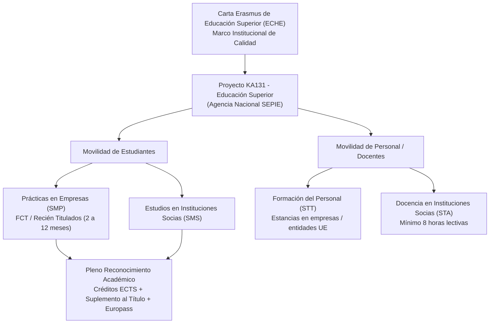

# Erasmus+ Educación Superior: Acción Clave 1 (KA1)

En nuestro centro educativo, la gestión del programa **Erasmus+** se concentra exclusivamente en el ámbito de la **Educación Superior** (Ciclos Formativos de Grado Superior) a través de la **Acción Clave 1 (KA1 - KA131-HED)**: *Movilidad de las personas por motivos de aprendizaje*.

El centro cuenta con la concesión de la **Carta Erasmus de Educación Superior (ECHE - Erasmus Charter for Higher Education)** por parte de la Comisión Europea, lo que nos acredita formalmente para participar y compromete a nuestra institución con los estándares de máxima calidad y transparencia internacional.

---

## Estructura del Programa KA1 en el Centro

---

## Principios Fundamentales (Compromisos ECHE)

1. **Pleno Reconocimiento Académico:** Garantizar que los créditos **ECTS** obtenidos durante la estancia internacional para el módulo de FCT o formativo sean convalidados e incorporados íntegramente al expediente académico del alumno sin requisitos adicionales.
2. **Gratuidad e Igualdad de Acceso:** No cobrar ninguna tasa de matrícula o examen al estudiante por la realización de su movilidad en destino y fomentar la participación activa de personas con menores oportunidades.
3. **Acuerdo de Aprendizaje Previo (*Learning Agreement*):** Formalización digital y firma tripartita (estudiante, centro de origen y entidad de acogida) antes del inicio de la estancia.
4. **Digitalización Integral (*Erasmus Without Paper - EWP*):** Tramitación digitalizada de convenios, acuerdos y expedientes.
5. **Transparencia y Calidad:** Publicación abierta de los criterios de selección, baremos, ayudas económicas y apoyo lingüístico mediante la plataforma **OLS (Online Language Support)**.

---

## Navegación por la Sección

- **[Movilidades de Alumnado (Prácticas / FCT)](movilidades-alumnado.md):** Requisitos, modalidades de prácticas (SMP), duración (mínimo 2 meses), recién titulados, cuantías de ayuda por país e inclusión.
- **[Movilidades de Profesorado (STA / STT)](movilidades-profesorado.md):** Oportunidades para personal de Grado Superior en docencia y formación técnica.
- **[Carta ECHE y Reconocimiento ECTS](carta-eche-reconocimiento.md):** Política europea del centro, sistema de convalidación de créditos ECTS y Suplemento Europeo al Título.
