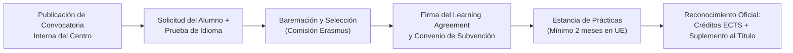

# Movilidades de Alumnado en Educación Superior (KA1)

En el marco de la **Acción Clave 1 (KA131-HED)** de Educación Superior, el alumnado de **Ciclos Formativos de Grado Superior (CFGS)** tiene acceso a movilidades internacionales de prácticas con plena validez académica.

---

## Modalidades de Movilidad

### 1. Prácticas en Empresas (SMP - *Student Mobility for Traineeships*)
Es la modalidad principal del centro. Permite a los estudiantes realizar su periodo obligatorio de prácticas en empresas, centros de investigación u organizaciones del tejido productivo de países participantes en Erasmus+.

- **Para estudiantes en curso (FCT curricular):** Realización total o parcial del módulo de **Formación en Centros de Trabajo (FCT)** / Formación en Empresa.
- **Para recién titulados (*Recent Graduates*):** Estancias de prácticas profesionales en empresas europeas realizadas durante los **12 meses posteriores** a la finalización de los estudios. La solicitud y selección deben realizarse obligatoriamente mientras el alumno aún está matriculado en el último curso.

### 2. Duración de la Movilidad
- **Estancia mínima:** **2 meses (60 días)** de prácticas presenciales continuadas.
- **Estancia máxima:** Hasta **12 meses** por ciclo formativo.
- **Movilidad Combinada (*Blended Mobility*):** Periodo físico presencial de entre 5 y 30 días combinado con un componente formativo virtual colaborativo obligatorio.

---

## Dotación Económica y Becas Erasmus+

Las becas KA1 de Educación Superior son asignadas por la Unión Europea a través del **SEPIE** y constan de:

### 1. Ayuda Individual Mensual (Coste de Vida)
El importe mensual varía según el grupo de coste de vida del país de destino fijado anualmente por la Agencia Nacional:

| Grupo de Países | Países de Destino (Ejemplos) | Ayuda Mensual Base (Aprox.) |
| :--- | :--- | :---: |
| **Grupo 1 (Coste alto)** | Dinamarca, Finlandia, Irlanda, Islandia, Liechtenstein, Luxemburgo, Noruega, Suecia. | **~500 - 600 € / mes** |
| **Grupo 2 (Coste medio)** | Alemania, Austria, Bélgica, Chipre, Francia, Grecia, Italia, Malta, Países Bajos, Portugal. | **~450 - 550 € / mes** |
| **Grupo 3 (Coste moderado)** | Bulgaria, Croacia, Eslovaquia, Eslovenia, Estonia, Hungría, Letonia, Lituania, Polonia, Chequia, Rumanía, Macedonia del Norte, Serbia, Turquía. | **~400 - 500 € / mes** |

### 2. Complementos Adicionales
- **Complemento de Prácticas:** Incremento mensual específico para movilidades de formación práctica en empresa (SMP).
- **Apoyo a la Inclusión:** Ayuda adicional mensual (~250 €/mes) para estudiantes con menores oportunidades (beneficiarios de beca general de estudios, situación de discapacidad reconocida $\ge 33\%$, familias monoparentales o en situación de vulnerabilidad).
- **Viaje Ecológico (*Green Travel*):** Asignación adicional única y hasta 4 días de ayuda individual suplementaria para quienes utilicen medios de transporte sostenibles (tren, autobús o coche compartido).

---

## Criterios de Selección y Baremación

La Comisión de Selección de Internacionalización del centro valora las candidaturas de acuerdo con criterios objetivos y públicos:

1. **Competencia Lingüística:** Acreditación de nivel de idioma del país de destino o inglés (pruebas oficiales o prueba de nivel específica del centro).
2. **Expediente Académico:** Nota media de los módulos del ciclo formativo de Grado Superior cursados hasta la fecha.
3. **Informe del Equipo Educativo:** Valoración de la madurez, autonomía, responsabilidad profesional y capacidad de trabajo en equipo.
4. **Entrevista / Carta de Motivación:** Exposición de objetivos profesionales y adecuación del perfil a la entidad de acogida.
5. **Criterios de Inclusión:** Puntuación de discriminación positiva para estudiantes con menores oportunidades.

---

## Documentación Preceptiva del Alumno

1. **Acuerdo de Aprendizaje para Prácticas (*Learning Agreement for Traineeships*):** Define el plan de trabajo, tareas, tutor en empresa, tutor en centro y créditos ECTS a convalidar. Debe estar firmado por las 3 partes antes del viaje.
2. **Convenio de Subvención (*Grant Agreement*):** Contrato financiero entre el centro y el estudiante que fija las cuantías y plazos de pago (habitualmente 80% previo al viaje y 20% al regreso tras la justificación).
3. **Evaluación de Idiomas OLS (*Online Language Support*):** Evaluación diagnóstica inicial en la plataforma europea y acceso a cursos de refuerzo gratuitos.
4. **Certificado de Estancia (*Traineeship Certificate*):** Documento firmado por la empresa de destino al finalizar el periodo, detallando las fechas efectivas y la evaluación del desempeño.
5. **Cuestionario Final del Participante (*EU Survey*):** Informe de satisfacción telemático obligatorio al regreso.
