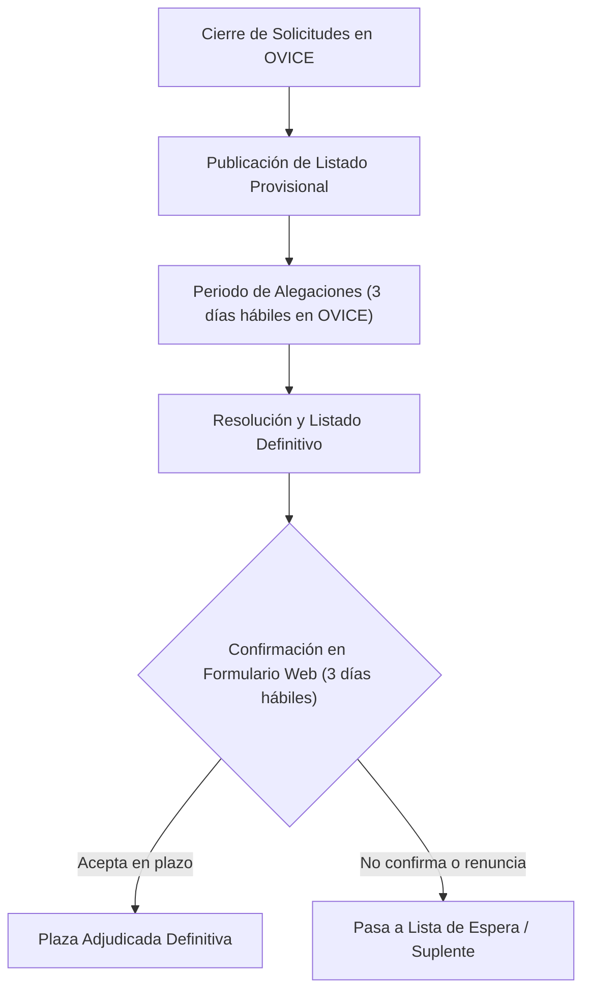

# Adjudicación de Plazas, Alegaciones y Confirmación

Una vez finalizado el plazo de presentación en OVICE, se inicia la fase de baremación, adjudicación y formalización de plazas por parte de la Dirección General de Formación Profesional (DGFP).

---

## Fases del Proceso de Adjudicación

---

## 1. Listado Provisional y Alegaciones

1. **Publicación Provisional:**  
   La DGFP publica en el portal web oficial del programa el listado provisional con las puntuaciones asignadas a cada participante y las plazas preadjudicadas.
2. **Plazo de Alegaciones:**  
   Las personas solicitantes disponen de un plazo improrrogable de **tres días hábiles**, contados a partir del día siguiente a la publicación del listado provisional.
3. **Canal de Alegaciones:**  
   Las reclamaciones se interponen exclusivamente **a través del mismo trámite OVICE** empleado para la solicitud inicial.

---

## 2. Listado Definitivo de Adjudicación

- Una vez estudiadas y resueltas las alegaciones, la DGFP publicará la resolución con el **listado definitivo**.
- Esta publicación **surte plenos efectos de notificación** a todas las personas interesadas.
- Las personas que no resulten adjudicatarias pasan automáticamente a formar parte de la **bolsa / lista de espera**, conservando íntegra su puntuación para cubrir posibles renuncias sobrevenidas.

---

## 3. Confirmación Obligatoria de la Plaza

!!! warning "Trámite Crítico: Confirmación de Plaza en 3 Días"
    Obtener una plaza en el listado definitivo **no garantiza la movilidad por sí solo**. La persona seleccionada debe ratificar formalmente su aceptación:
    
    - **Plazo:** **Tres días hábiles** a contar desde la publicación de la resolución definitiva.
    - **Medio:** Mediante el formulario electrónico específico habilitado al efecto, cuyo enlace se difundirá en la web de Euro Trainee Profesorado.
    - **Consecuencia de no confirmar:** Si la persona no confirma dentro del plazo de 3 días hábiles, **se entenderá que renuncia a la plaza**. Dicha plaza se reasignará de inmediato a la siguiente persona en la lista de suplentes.

---

## Resumen de Plazos Clave

| Hito | Plazo Oficial | Vía / Soporte |
| :--- | :---: | :--- |
| **Presentación de Solicitudes** | **7 días hábiles** | Trámite OVICE (por Dirección del centro) |
| **Alegaciones al Listado Provisional** | **3 días hábiles** | Mismo trámite OVICE |
| **Aceptación de Plaza Definitiva** | **3 días hábiles** | Formulario web enlace oficial DGFP |
