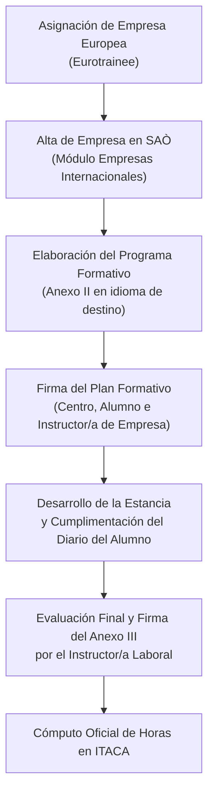

# Reconocimiento de Horas de Prácticas (FE / FCT) y Plataforma SAÒ

Una de las principales ventajas del programa **Euro Trainee Alumnado** es que las horas de estancia formativa en empresas europeas (4 o 6 semanas) pueden ser computadas y convalidadas como horas oficiales de **Formación en Empresa (FE)** o del módulo de **Formación en Centros de Trabajo (FCT)**.

---

## Criterios para el Reconocimiento Académico

Para que las horas realizadas en la empresa europea se reconozcan oficialmente en el expediente del ciclo formativo:

1. **Alineación de Resultados de Aprendizaje:** Las actividades y tareas desarrolladas en la empresa de destino deben contribuir de forma demostrable a la adquisición de las capacidades y resultados de aprendizaje previstos en el currículo del ciclo formativo.
2. **Duración de la Estancia:** Las estancias tienen una duración estipulada de **4 o 6 semanas**, computándose las horas de trabajo efectivas desarrolladas en destino.
3. **Gestión Administrativa Obligatoria:** Todas las movilidades deben registrarse y gestionarse preceptivamente a través de la plataforma oficial **SAÒ** (*Sistema d'Aprenentatge en l'Organització* / ITACA 3 - SAÒ) de la Generalitat Valenciana.

---

## Procedimiento de Gestión en SAÒ (ITACA 3)

### Documentación Preceptiva en SAÒ
- **Anexo II (Programa Formativo):** Detalla las tareas técnicas y competencias a desarrollar en la empresa extranjera. Es altamente recomendable redactarlo en el idioma de trabajo de la empresa de destino para facilitar la comprensión del tutor laboral.
- **Anexo III (Informe de Valoración):** Instrumento de evaluación final cumplimentado y firmado por la persona instructora de la empresa europea al terminar la estancia.
- **Diario de Prácticas del Alumnado:** Registro semanal de actividades realizadas por el estudiante durante sus 4 o 6 semanas.

---

## Seguro del Alumnado

!!! info "Póliza de Cobertura Específica"
    - El alumnado participante en **Euro Trainee** (al igual que en Erasmus+) cuenta con una **póliza de seguro internacional propia** contratada y cubierta íntegramente por la Generalitat Valenciana.
    - Esta póliza cubre asistencia sanitaria en el extranjero, repatriación, contingencias de accidentes y responsabilidad civil.
    - Por tanto, la cobertura aseguradora **no está vinculada a las pólizas estándar de los anexos ordinarios de SAÒ** de ámbito autonómico.
