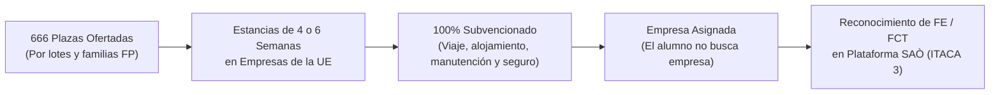

# Eurotrainee Alumnado: Requisitos y Plazas

El programa **Euro Trainee Alumnado** de la Generalitat Valenciana (DGFP), cofinanciado por el **Fondo Social Europeo Plus (FSE+)**, ofrece a los estudiantes de Formación Profesional estancias prácticas becadas en empresas u organizaciones de la Unión Europea.

---

## Características de las Movilidades de Alumnado

| Parámetro | Detalle Oficial |
| :--- | :--- |
| **Total de Plazas** | **666 plazas** para el alumnado de Formación Profesional de la Comunitat Valenciana. |
| **Duración de la Estancia** | **4 o 6 semanas** de formación práctica en la empresa de destino. |
| **Destinos** | Empresas, entidades u organizaciones educativas en países miembros de la Unión Europea. |
| **Asignación de Empresa** | Las empresas de prácticas son **asignadas directamente por el programa**; el estudiante viaja con la empresa y el plan fijado. |
| **Cobertura Económica** | **100 % subvencionado:** Cubre billetes de viaje (vuelos/transporte), alojamiento, manutención y seguro propio de Eurotrainee. El alumno no debe adelantar fondos para estos conceptos (solo fianza/depósito si la plaza adjudicada lo exige). |
| **Marco Financiero** | Cofinanciado por el **Fondo Social Europeo Plus (FSE+)**. |

---

## Requisitos de Participación del Alumnado

El alumnado que desee solicitar una plaza del programa Euro Trainee debe cumplir los siguientes requisitos en el momento de la convocatoria:

1. **Matriculación Activa:**  
   Estar matriculado en un ciclo formativo de **Grado Medio** o de **Grado Superior** de FP en un centro educativo público o privado concertado dependiente de la Generalitat Valenciana.
2. **Cursos Admitidos:**  
   Pueden participar indistintamente estudiantes matriculados en **primer curso** o en **segundo curso** del ciclo formativo.
3. **Edad Mínima:**  
   Tener cumplidos al menos **16 años** antes del inicio efectivo de la movilidad.
4. **Requisitos del País de Destino:**  
   Cumplir los requisitos sanitarios, administrativos, migratorios o de documentación (DNI/Pasaporte en vigor) exigidos por el país de acogida.
5. **Compromiso con los Cuestionarios FSE+:**  
   Cumplimentar obligatoriamente los tres cuestionarios de seguimiento exigidos por la Comisión Europea (previo, final y a los 6 meses).

!!! tip "¿Es obligatorio tener un título de idiomas B1/B2?"
    **No es obligatorio tener certificado de idiomas para participar.** Cualquier estudiante de FP que cumpla los requisitos de matrícula y edad puede solicitar plaza. No obstante, aportar un certificado oficial de idiomas permite obtener puntuación adicional en el baremo de selección.
