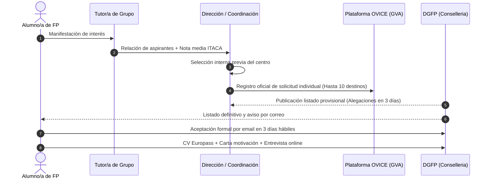

# Tramitación, Selección y Adjudicación: Alumnado

El procedimiento de solicitud de plazas de Eurotrainee Alumnado combina la labor de orientación de la tutoría de FP, la validación del centro educativo y el registro telemático a través de OVICE por el equipo directivo.

---

## Flujo Completo del Procedimiento

---

## 1. Fase Previa y Selección Interna en el Centro

1. **Comunicación a la Tutoría:** El estudiante interesado debe dirigirse en primer lugar a su tutor/a de grupo.
2. **Selección Interna del Centro:** De acuerdo con las instrucciones de la DGFP, el centro educativo puede realizar una **selección interna previa** entre los aspirantes, aplicando criterios pedagógicos objetivos (aprovechamiento académico, actitud profesional, madurez y asistencia).
3. **Recopilación de Datos:** El alumnado y la tutoría facilitan a la dirección los certificados de idiomas (si dispone de ellos) y la selección de hasta **10 destinos preferidos**.

---

## 2. Presentación Telemática en OVICE

!!! danger "Competencia Exclusiva de la Dirección del Centro"
    Al igual que en la modalidad de profesorado, las solicitudes de alumnado **solo pueden ser presentadas por la dirección del centro educativo** a través del trámite oficial en **OVICE**. Cada estudiante cuenta con un expediente individual.

### Datos que se Introducen en la Solicitud
- **Datos de la persona candidata:** Nombre, DNI/NIE, ciclo de Grado Medio o Superior y curso.
- **Relación de plazas solicitadas:** Hasta **10 destinos** seleccionados del catálogo oficial de la convocatoria, ordenados por orden de preferencia.
- **Nota Media Académica:** Con **dos decimales**, calculada de oficio a partir de la última evaluación disponible registrada en la plataforma **ITACA**.
- **Autobaremo (Anexo II):** Puntuación de idiomas acreditados oficialmente.
- **Criterio de Género (Apartado h):** Puntuación adicional si el participante pertenece al género subrepresentado ($< 30\%$) en la familia profesional matriculada, según las tablas publicadas por la Conselleria.
- **Declaración responsable:** Acreditación de que el candidato cumple con todos los requisitos.

---

## 3. Adjudicación, Alegaciones y Confirmación

### A. Listado Provisional y Alegaciones
- La DGFP publica en la web oficial el listado provisional de aspirantes seleccionados y lista de reserva.
- **Plazo de alegaciones:** **Tres días hábiles** desde la publicación en la web, remitiendo escrito fundamentado por correo a `eurotrainee@gva.es`.

### B. Listado Definitivo y Aceptación de la Plaza
- Tras resolver las alegaciones, se publica el listado definitivo de adjudicación.
- La DGFP notifica simultáneamente por correo electrónico a la persona seleccionada, a su tutor/a y a la dirección del centro.
- **Plazo estricto de confirmación:** **Tres días hábiles** para confirmar la plaza o desistir.

!!! warning "Formato Obligatorio del Correo de Aceptación"
    La confirmación debe remitirse desde el mismo correo electrónico indicado en la solicitud a `eurotrainee@gva.es`:
    
    - **Asunto del mensaje:** `Aceptación/Renuncia – Euro Trainee Alumnado`
    - **Cuerpo del mensaje:**
        - Nombre completo y DNI del alumno/a.
        - Declaración expresa de aceptación o rechazo.
        - Código de la plaza adjudicada.
        - Nombre, apellidos y correo electrónico del tutor/a de grupo.
    
    *Cualquier alteración en el asunto o envío fuera de plazo supone la pérdida automática de la plaza, que pasa al siguiente suplente.*

---

## 4. Actuaciones Posteriores Obligatorias

Tras aceptar la plaza, el alumno debe preparar la siguiente documentación técnica para la entidad de acogida:

1. **Currículum Vitae Europass:** En formato estándar europeo y redactado en inglés (o en la lengua del país de destino).
2. **Carta de Motivación:** Exposición de intereses y perfil profesional en inglés.
3. **Entrevista Online:** Reunión telemática de presentación con la empresa u organización europea de acogida para validar el plan de trabajo.
4. **Fianza o Depósito:** Exclusivamente en aquellos casos en que la plaza adjudicada requiera un depósito económico para el alojamiento (reembolsable al finalizar la estancia).
