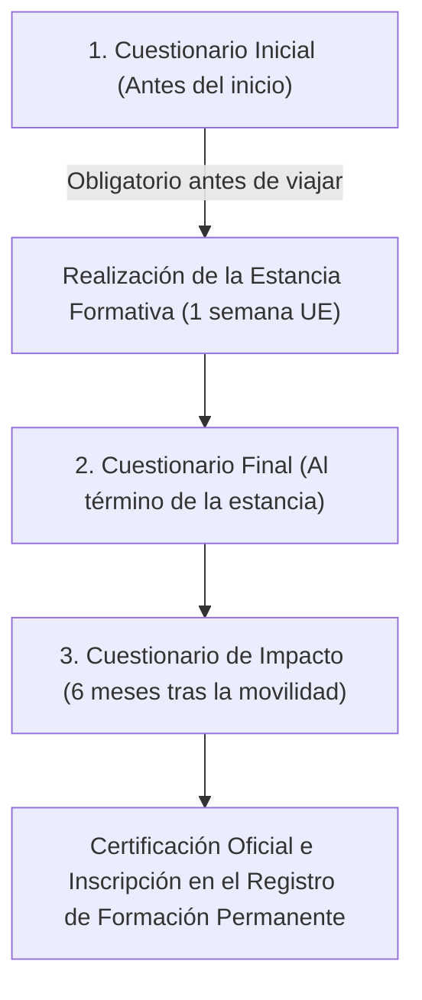

# Fases Posteriores, Cuestionarios y Certificación

Tras la confirmación definitiva de la plaza adjudicada, el profesorado participante asume una serie de compromisos formativos, evaluativos y administrativos indispensables para la realización de la estancia y su posterior reconocimiento oficial.

---

## 1. Sesión Informativa Previa

Antes del inicio del viaje y de la estancia en el país de destino:
- La **Dirección General de Formación Profesional (DGFP)** convocará una **reunión o sesión informativa de asistencia obligatoria** para todo el profesorado adjudicatario.
- En dicha sesión se aclararán aspectos logísticos, de seguro, documentación de viaje, plan de trabajo en las entidades de acogida y protocolos de contacto ante incidencias en destino.

---

## 2. Los Tres Cuestionarios Obligatorios

El programa exige la cumplimentación de tres instrumentos de seguimiento y evaluación del impacto formativo:

| Cuestionario | Momento de Cumplimentación | Relevancia y Consecuencias |
| :--- | :--- | :--- |
| **Cuestionario 1 (Inicial)** | Previo a la salida hacia el país de destino. | :octicons-alert-16: **Crítico:** La no cumplimentación de este cuestionario inicial **supondrá la pérdida de la plaza adjudicada**. |
| **Cuestionario 2 (Final)** | Inmediatamente tras finalizar la semana de estancia. | Evaluación de la calidad de la entidad de acogida, metodologías aprendidas y consecución de objetivos. |
| **Cuestionario 3 (Impacto)** | A los **seis meses** de haber regresado al centro. | Medición de la transferencia real de conocimientos a los módulos y alumnado de Formación Profesional. |

---

## 3. Reconocimiento y Certificación Oficial

El profesorado que complete satisfactoriamente:

1. La estancia formativa de una semana con asistencia efectiva.
2. Los tres cuestionarios obligatorios en los plazos fijados.

Tendrá derecho a la emisión de la correspondiente **certificación oficial de formación del profesorado**, la cual será inscrita de oficio en el **Registro de Formación Permanente del Profesorado** de la Generalitat Valenciana, computando como mérito para sexenios, traslados y oposiciones según la normativa en vigor.

---

## 4. Canales de Comunicación y Seguimiento

- **Correo electrónico de contacto:** Todas las comunicaciones oficiales se remitirán a la dirección de correo electrónico consignada en la solicitud de OVICE. Debe revisarse con asiduidad (incluyendo la carpeta de spam).
- **Seguimiento del Centro:** La dirección y la coordinación de internacionalización del centro educativo acompañarán al docente durante todo el proceso.
- **Canal de consultas DGFP:** `eurotrainee@gva.es`.
