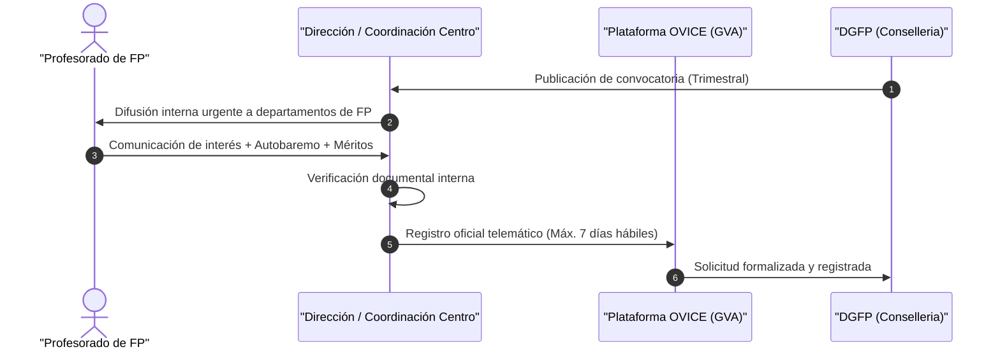

# Tramitación y Presentación de Solicitudes en OVICE

El procedimiento de solicitud del programa Eurotrainee Profesorado requiere una coordinación estrecha entre el docente aspirante y el equipo directivo del centro.

---

## Esquema del Procedimiento

---

## 1. Fase Previa en el Centro Educativo

Antes del registro electrónico, deben realizarse los siguientes pasos internos:

1. **Manifestación de interés:** El profesor/a comunica formalmente a la dirección o coordinación su voluntad de participar en la convocatoria activa.
2. **Autocomprobación de requisitos:** El docente verifica que cumple todos los requisitos exigidos (servicio activo, docencia efectiva en ciclo de GM o GS de FP, centro público o concertado, etc.).
3. **Selección de destinos:** El docente revisa el catálogo de plazas convocadas y selecciona hasta un **máximo de 10 movilidades**, ordenándolas por orden estricto de preferencia.
4. **Entrega de documentación:** El solicitante entrega a la dirección la documentación acreditativa para el autobaremo (certificados de idiomas, discapacidad, etc.).
5. **Revisión por la Dirección:** La dirección del centro comprueba que la documentación está completa y correcta antes de acceder a la plataforma.

---

## 2. Presentación Telemática en OVICE

!!! danger "Plataforma y Vía de Presentación Exclusiva"
    Las solicitudes se tramitan **únicamente** a través del trámite específico habilitado en **OVICE** (Oficina Virtual de Centros Educativos).
    
    La presentación física o el registro individual particular del docente no son válidos: **el trámite debe realizarse necesariamente a través de la dirección del centro educativo**.

### Plazo de Presentación
- **7 días hábiles**, computados a partir del día siguiente a la publicación de la convocatoria de plazas en la web de la DGFP.

### Contenido Obligatorio de la Solicitud
En el formulario telemático de OVICE se deben cumplimentar y aportar los siguientes bloques:

- **Datos identificativos:** Nombre, DNI/NIE, cuerpo docente y especialidad del participante.
- **Relación de plazas solicitadas:** Hasta **10 movilidades** ordenadas jerárquicamente por preferencia.
- **Autobaremo:** Cumplimentación de los apartados de méritos.
- **Documentación adjunta digitalizada:**
    - Certificados de competencia lingüística (inglés y otras lenguas UE).
    - Certificado oficial de grado de discapacidad (si procede).
    - Memoria o propuesta de actividades formativas vinculadas a la familia profesional.
- **Declaración responsable:** La presentación telemática conlleva la aceptación íntegra de las bases reguladoras y la declaración responsable sobre la veracidad de los datos y documentos aportados.

---

## Múltiples Solicitudes y Rectificaciones

Si una persona participante necesita modificar destinos o documentación dentro del plazo abierto:

!!! tip "Regla de la última solicitud"
    El sistema permite presentar varias solicitudes durante el plazo de 7 días hábiles. No obstante, **únicamente se considerará válida la última solicitud registrada** en OVICE dentro de dicho plazo. Las anteriores quedarán automáticamente anuladas.
